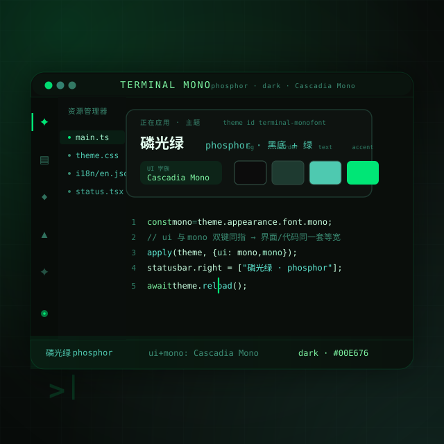

# 终端机 Terminal Mono



把整个 LinkDesk **变成一台磷光绿的终端机**——界面全换等宽字体、黑底绿字，像老式字符终端点亮了荧光管。

> 主题的乐趣不在「换个颜色」，而在「换个人格」。这个主题的人格是一台认真的、从头绿到脚的终端机器——连界面按钮和代码都共用同一套等宽字族。

## 这是什么

一个深色主题插件：选定后，LinkDesk 的**每一块界面**都按磷光绿终端配色重绘——窗口、侧栏、状态栏、弹层——同时把界面与等宽两套字族都指向 **Cascadia Mono**，让整个软件读起来像一台终端。

- 插件 ID：`theme-terminal`
- 主题 ID：`theme-terminal.terminal-monofont`（标签「终端机 Terminal Mono」）
- 模式：深色（dark）
- 作者：LinkDesk

## 穿上它的样子

| 部位 | 取值 | 感觉 |
|---|---|---|
| 底色 | 近黑 `#0C0C0C` | 老式 CRT 关机后的黑 |
| 主文字 | 绿青 `#4EC9B0` | 字符管余晖 |
| 强调色 | 磷光绿 `#00E676` | 荧光点亮的一笔 |
| 字族 | UI 与等宽都是 Cascadia Mono | 代码和界面同一种呼吸 |

## 换上去

在「主题：选择主题…」里挑 **终端机 Terminal Mono**，即时生效，随时换回。

## 结构

```
plugin.json                      插件清单（contributes.themes）
themes/terminal-monofont.json   主题定义（单 colorway「磷光绿 phosphor」+ 字族轴）
```
